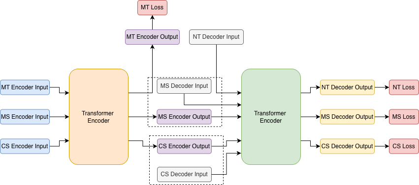

# ARJUN: A Parameter-Efficient Multi-Objective Pre-Training Framework for Language Models

The proliferation of large-scale language models has significantly advanced natural language processing capabilities; yet their substantial computational requirements create barriers for deployment in resource-constrained environments and limit accessibility for under-represented language communities. To address this fundamental issue, we present a novel multi-objective pre-training approach for developing parameter-efficient language models. Our method, implemented in our Arjun model family, strategically combines four complementary pre-training objectives within a unified transformer encoder-decoder framework: (1) Masked Token Prediction (MT) following BERT's bidirectional understanding paradigm, (2) Next Token Prediction (NT) incorporating autoregressive generation capabilities, (3) Masked Span Prediction (MS) that works on spans of text instead of just words, and (4) Complete Sentence Prediction (CS) adapted from T5 that bridge discriminative and generative tasks. Using this multi-objective approach, Arjun achieves competitive or superior performance for downstream applications with only 69M parameters, compared to models that are 2.5-4 times larger. Evaluations on 14 tasks across three languages---Bangla (Bengali), Tamil, and Hindi---show state-of-the-art results, with average macro-F1 gains of 1.3-1.7 percentage points (pp) on discriminative tasks and a 13.02 pp sacreBLEU improvement on Bangla generative tasks. Ablation studies confirm that joint training with all four objectives consistently outperforms single-objective and partial combinations, with improvements ranging from 0.5-2.0 pp across tasks, thereby validating the synergistic effects of our multi-objective framework.



## Pre-Trained Models
Below table are Arjun models pre-trained on multiple monolingual corpus,

| Model Name        | Parameters | Pre-training Corpus |
|-------------------|------------|---------|
| [Vac-Arjun (Base)](https://drive.google.com/file/d/1uxRO5ngJxm10P4zvWTk7HMJwmWg5xLoY/view?usp=sharing)    | 69M        | [Vacaspati](https://bangla.iitk.ac.in/Vacaspati.html) |
| [Vac-Arjun (Small)](https://drive.google.com/file/d/11pn8ld03naljH2kEBi4cupIkx8kpXFaf/view?usp=sharing)    | 17M        | [Vacaspati](https://bangla.iitk.ac.in/Vacaspati.html) |
| [Indic-BangArjun (Base)](https://drive.google.com/file/d/1vewLTVhHprhwSSnkgwV5XRdbeo_o61_m/view?usp=sharing)    | 69M        | [IndicCorp v2 (Bangla Subset)](https://huggingface.co/datasets/ai4bharat/IndicCorpV2/tree/main/data) |
| [Indic-TamArjun (Base)](https://drive.google.com/file/d/1yT0W8iYW6sy3ZMfgkxTftip_oCbFVKU-/view?usp=sharing)    | 69M        | [IndicCorp v2 (Tamil Subset)](https://huggingface.co/datasets/ai4bharat/IndicCorpV2/tree/main/data) |
| [Indic-HindArjun (Base)](https://drive.google.com/file/d/10NF126xujkUizq_1yOKnKrTVUsqmgfSU/view?usp=sharing)    | 69M        | [IndicCorp v2 (Hindi Subset)](https://huggingface.co/datasets/ai4bharat/IndicCorpV2/tree/main/data) |


## Arjun Model Card

### Installation

#### Install from PyPI (Coming Soon)
Once published to PyPI, you can install the package using:
```bash
$ pip install arjun-mtl
```

#### Install from Source
To install the package from source:
```bash
$ git clone https://github.com/pidahbus/multi-task-learning.git
$ cd multi-task-learning
$ pip install -e .
```

#### Development Setup
For development, create a conda environment and install in editable mode:
```bash
$ conda create -n arjun python=3.9 -y
$ conda activate arjun
$ pip install -e .[dev]
```

### Load Arjun Tokenizer
The Arjun tokenizer can be loaded using the following set of commands:

```python
from arjun import ArjunTokenizer
TOKENIZER_PATH = "../resources/vac-arjun-base/"
tokenizer = ArjunTokenizer.from_pretrained(TOKENIZER_PATH)
```

### Load Arjun Model
Building the ARJUN model is straightforward and can be performed using the following set of commands:

```python
from arjun import ArjunModel
PRETRAINED_MODEL_PATH = "../resources/vac-arjun-base/"
model = ArjunModel.from_pretrained(PRETRAINED_MODEL_PATH)
```

### Run Pre-Training
To pre-train the Arjun model, use the [Pre-Training Notebook](notebooks/pretrain.ipynb). 

### Fine-Tune on Downstream Tasks
To fine-tune the Arjun model on downstream tasks, use the [Fine-Tuning Notebook](notebooks/finetune.ipynb). 

